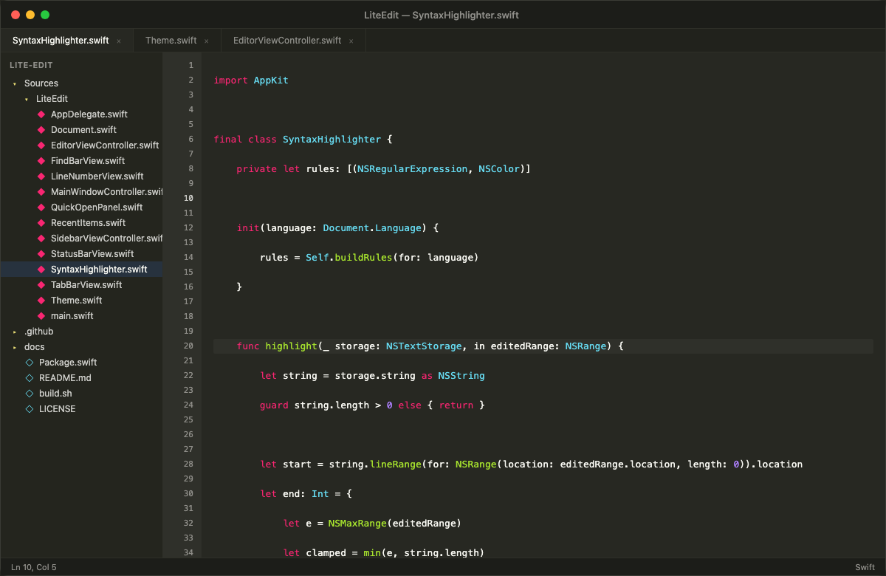
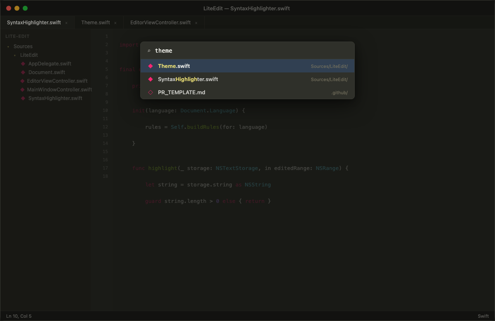
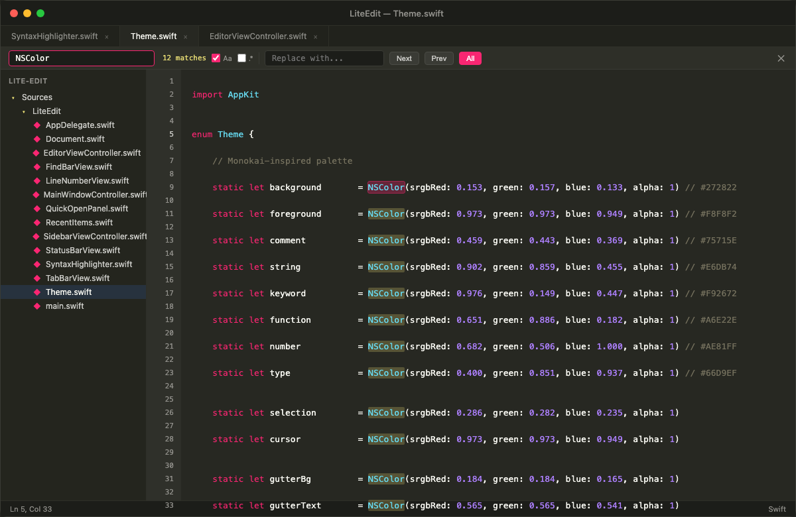

# LiteEdit

The fastest way to open, browse, and quick-edit code on macOS — a native editor under 1 MB, built entirely with Swift and AppKit.

[](https://arietan.github.io/lite-edit/)
[](https://arietan.github.io/lite-edit/)
[](LICENSE)
[](https://github.com/arietan/lite-edit/releases/latest)

**[Website](https://arietan.github.io/lite-edit/)** · **[Download](https://github.com/arietan/lite-edit/releases/latest)** · **[Source](https://github.com/arietan/lite-edit)**

---

## Screenshots



*Syntax highlighting, sidebar file tree, tabbed editing, line numbers, and status bar — all in under 1 MB.*

<details>
<summary>Quick Open (Cmd+P)</summary>



</details>

<details>
<summary>Find & Replace (Cmd+F)</summary>



</details>

---

## Who This Is For

LiteEdit is for macOS developers who want a **fast, zero-overhead editor** alongside their main IDE. Use it when you want to:

- **Open a repo instantly** — browse code and read through files without waiting for VS Code to load
- **Make quick edits** — fix a typo, tweak a config, update a script, and close
- **Review files** — read through Markdown, JSON, YAML, or logs with syntax highlighting and zero lag
- **Stay in flow** — keep a snappy editor open for side tasks while your IDE handles the heavy project

### Who This Is Not For

LiteEdit is not trying to replace VS Code, Xcode, or Sublime Text. If you need extensions, LSP, integrated terminals, or Git UI, use those. LiteEdit is the tool you reach for when you want to **open, read, edit, and move on — in seconds**.

---

## Why LiteEdit?

Most code editors ship hundreds of megabytes of bundled runtimes, web engines, and frameworks before you even open a file. LiteEdit takes the opposite approach: a single native binary under 1 MB that launches instantly and uses minimal resources.

### Size Comparison

| Editor | App Size | RAM at Idle | Runtime |
|---|---|---|---|
| **LiteEdit** | **< 1 MB** | **~20 MB** | Native (AppKit) |
| Sublime Text | ~40 MB | ~90–140 MB | Native (C++) |
| VS Code | ~400 MB | ~226+ MB | Electron (Chromium + Node.js) |

The entire app — editor, syntax highlighter, file explorer, session persistence — compiles to a single sub-megabyte binary from ~3,000 lines of Swift. Zero dependencies. Zero frameworks. Just `swift build`.

### What Makes It Different

- **Instant launch** — no runtime to bootstrap, opens in milliseconds
- **Native macOS citizen** — built on AppKit and TextKit, uses system text rendering, respects macOS conventions
- **Single binary** — no `node_modules`, no embedded Chromium, no support files
- **Session persistence** — remembers your folder, open tabs, cursor positions, and window state across restarts
- **Multi-cursor editing** — VS Code-style Cmd+Shift+L to rename across a file in one shot

---

## Features

- **Syntax highlighting** for 20+ languages (Swift, Python, JS/TS, Rust, Go, C/C++, Java, HTML, CSS, JSON, YAML, SQL, and more)
- **Tabbed editing** with Cmd+W to close, Cmd+click for new tab
- **Sidebar file explorer** with folder tree navigation
- **Find & Replace** with regex support and match count
- **Quick Open** (Cmd+P) for fast file switching
- **Session persistence** — reopens your folder, files, cursor positions, and window state on relaunch
- **Line numbers** with current-line highlighting
- **Status bar** showing cursor position and detected language

### Keyboard Shortcuts

| Shortcut | Action |
|---|---|
| Cmd+N | New file |
| Cmd+O | Open file |
| Cmd+Shift+O | Open folder |
| Cmd+S | Save |
| Cmd+Shift+S | Save as |
| Cmd+W | Close tab |
| Cmd+F | Find & Replace |
| Cmd+G | Go to line |
| Cmd+P | Quick Open |
| Cmd+B | Toggle sidebar |
| Option+Up/Down | Move line up/down |
| Cmd+Shift+K | Delete current line |
| Cmd+Shift+L | Select all occurrences (multi-cursor edit) |

---

## Install

Download the latest DMG from the [Releases page](https://github.com/arietan/lite-edit/releases/latest), open it, and drag LiteEdit to Applications.

> **macOS Gatekeeper note:** Because the app is not signed with an Apple Developer certificate, macOS may show *"LiteEdit is damaged and can't be opened."* This is a false positive — run the command below to clear the quarantine flag, or install via Homebrew which handles it automatically:
>
> ```bash
> xattr -rd com.apple.quarantine /Applications/LiteEdit.app
> ```

**Or install with Homebrew** (no quarantine issue):

```bash
brew install arietan/lite-edit/lite-edit
```

## Build from Source

Requires **Xcode Command Line Tools** and **macOS 13+**.

```bash
# Build and package the .app bundle
bash build.sh

# Run directly
open LiteEdit.app

# Or install to /Applications
cp -r LiteEdit.app /Applications/

# Or create a DMG installer
bash create-dmg.sh
```

## Project Structure

```
lite-edit/
├── Package.swift
├── build.sh
├── Sources/LiteEdit/
│   ├── main.swift                          # App entry point
│   ├── AppDelegate.swift                   # Menu bar, app lifecycle
│   ├── MainWindowController.swift          # Window, tabs, session persistence
│   ├── EditorViewController.swift          # Text view, find/replace, cursor
│   ├── EditorViewController+Shortcuts.swift # Line move, delete, multi-edit
│   ├── SidebarViewController.swift         # File tree explorer
│   ├── SyntaxHighlighter.swift             # Regex-based highlighting
│   ├── Document.swift                      # File model
│   ├── TabBarView.swift                    # Tab strip
│   ├── FindBarView.swift                   # Find/replace bar
│   ├── StatusBarView.swift                 # Bottom status bar
│   ├── LineNumberView.swift                # Gutter with line numbers
│   ├── QuickOpenPanel.swift                # Cmd+P fuzzy file picker
│   ├── RecentItems.swift                   # Recent files/folders
│   └── Theme.swift                         # Colors and fonts
└── .gitignore
```

## Contributing

See [CONTRIBUTING.md](CONTRIBUTING.md) for guidelines on how to contribute.

## License

[MIT](LICENSE)
